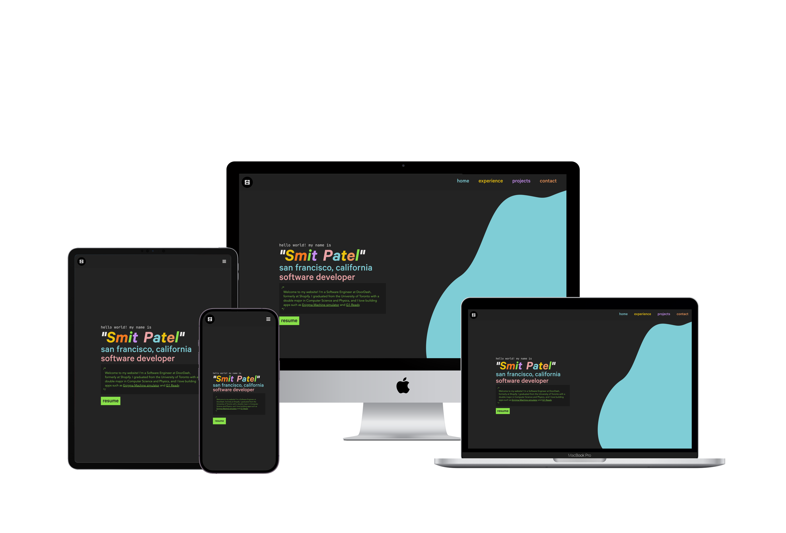

# Personal Website

My personal portfolio website showcasing my experience, projects, and contact information.

**Live Site:** https://www.smitpatel.me/

## Setup

To run locally:

1. Navigate into the project directory
2. Run `npm install` to install dependencies
3. Run `npm run develop` to start the development server at http://localhost:8000

## Credits

**Design Assets:**

- CN Tower skyline designed by [Freepik](https://www.freepik.com/)
- Helicopter & clouds designed by [pch.vector / Freepik](https://www.freepik.com)
- Social media & Android icons by [Icon Monstr](https://iconmonstr.com/)

## License

MIT License - see [LICENSE](LICENSE) for details.

## Screenshots

  

